# 看见音乐发行产品体系：产品架构总结 v1.0

> 日期：2026-09-09  
> 状态：**Phase 1 产品架构收口版**  
> 结论：产品架构阶段完成，可以进入 Phase 2 商业模式设计。

---

# 1. 最终架构结论

看见音乐未来的发行产品体系，不是三个彼此独立的发行系统，而是：

> **一套统一发行能力底座 + 三条商业产品线 + 一套统一的商业与服务基础能力。**

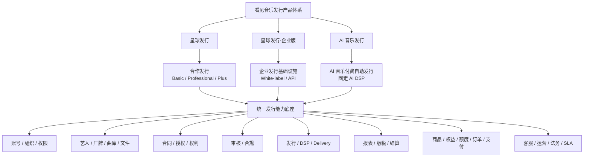

---

# 2. 三条产品线分别是什么

## 2.1 星球发行

**看见音乐直接运营的合作发行产品。**

```text
客户：音乐人 / 厂牌 / 版权公司 / CP
运营主体：看见音乐
产品入口：现有星球发行前台升级
商业关系：合作发行
版本：Basic / Professional / Plus
```

它继续承担：

- 签约；
- 艺人和内容管理；
- 数字发行；
- 渠道交付；
- 月度报表与版税；
- 提现；
- 客服、运营、版权、法务支持。

三档版本的意义是：

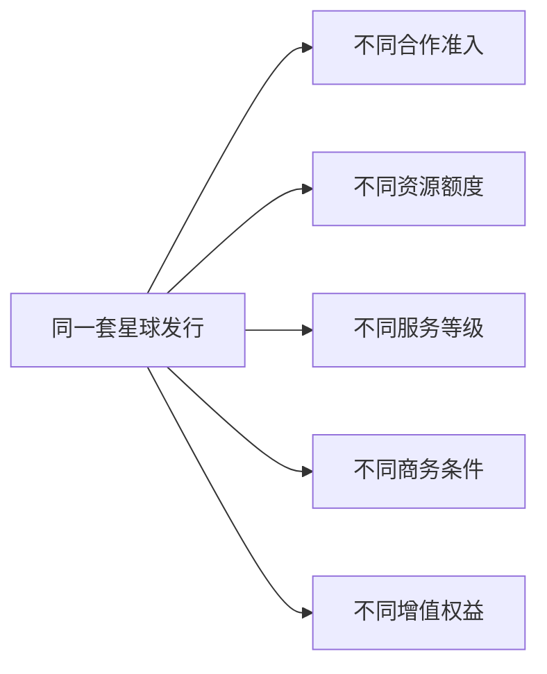

而不是制造三套不同的发行前台。

---

## 2.2 星球发行·企业版

**向希望自己开展音乐发行业务的企业输出发行基础设施。**

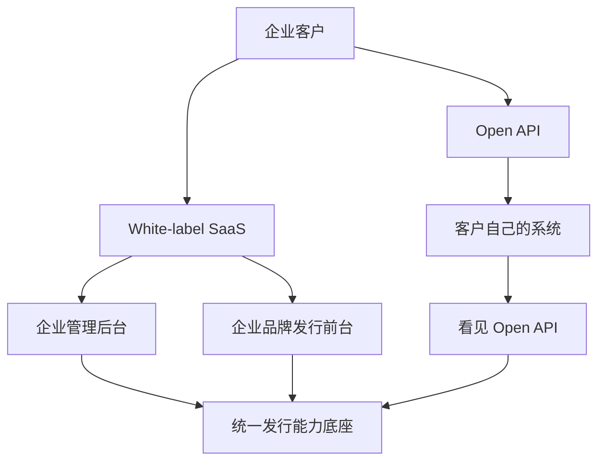

企业版的核心区别是：

> **企业客户自己成为发行平台的 Operator。**

看见提供系统、能力、发行链路和基础设施，企业自己经营自己的用户、CP 和业务。

---

## 2.3 AI 音乐发行

**专门为 AI 音乐流通建立的付费自助发行产品。**

```text
核心商品：AI 音乐发行服务
核心用户：AI 音乐创作者 / AI 音乐工作室 / 高频创作者
运营主体：看见音乐 + 自助系统
产品入口：独立自助发行前台
收费关系：购买发行服务，而不是传统版税分成
渠道：固定的一组 AI 音乐可发行 DSP
```


AI 音乐发行允许普通音乐使用，但产品定位、渠道和商业模式围绕 AI 音乐流通设计。

底层不分两套 Catalog / Release 模型。

---

# 3. 产品架构的五层结构

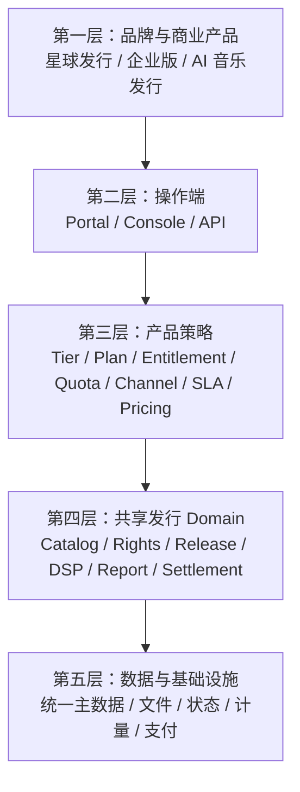

这个分层解决一个核心问题：

> 同一个底层发行能力，如何在三条产品线里形成完全不同的产品和商业模式。

---

# 4. 共享发行 Domain

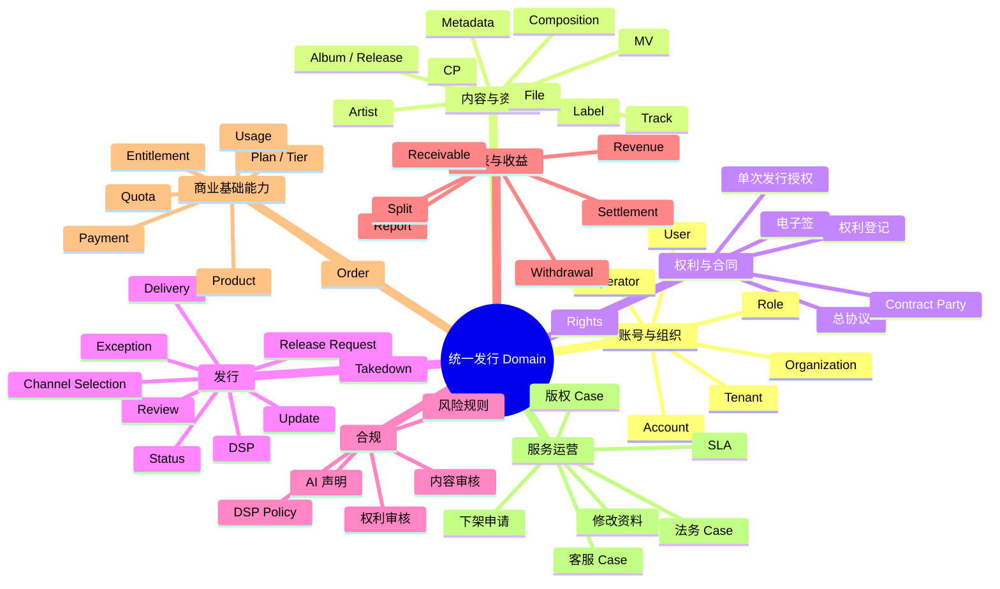

---

# 5. 三条产品共用什么、各自独立什么

## 必须共享

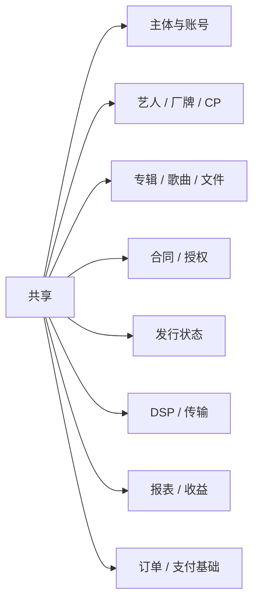

## 可以独立

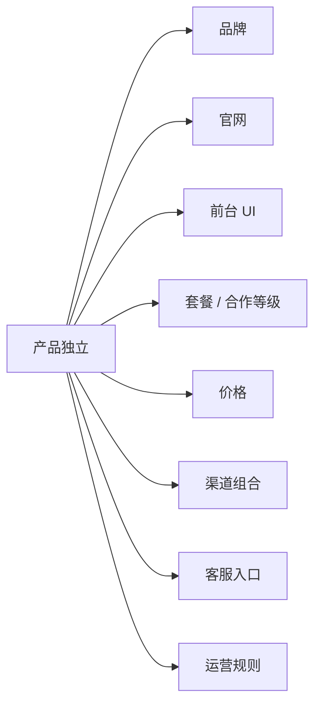

---

# 6. Operator 是连接三条产品的关键角色

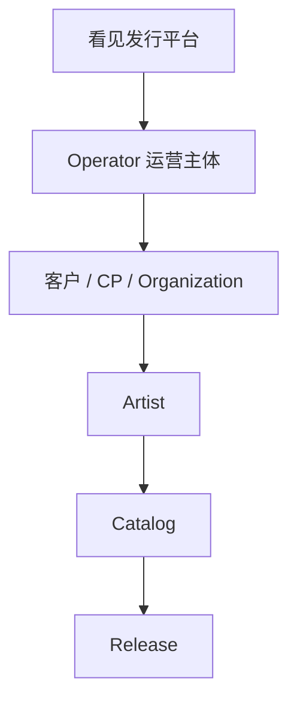

| 产品 | Operator |
|---|---|
| 星球发行 | 看见音乐 |
| 企业版 White-label | 企业客户 |
| 企业版 API | 企业客户 |
| AI 音乐发行 | 看见音乐 / 自助系统 |

Operator 关联：

- 品牌；
- 客户归属；
- 合同主体；
- 可用产品；
- 渠道范围；
- 审核策略；
- 服务策略；
- 结算关系。

---

# 7. 商业能力不再散落在三个产品里

未来三个产品都需要：

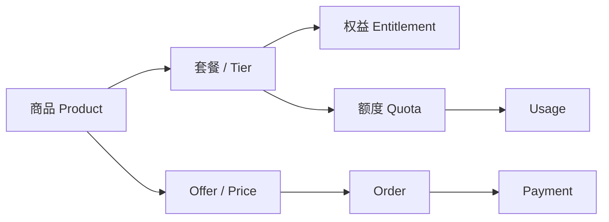

不同产品的使用方式不同：

| 商业基础能力 | 星球发行 | 企业版 | AI 音乐发行 |
|---|---|---|---|
| Product | 合作发行产品 | SaaS / API 模块 | AI 发行服务商品 |
| Plan / Tier | Basic / Pro / Plus | 套餐 / 模块 | 按次 / 订阅档位 |
| Entitlement | 合作权益 | 开通模块 | 已购买服务 |
| Quota | 曲库 / 艺人 / 发行等 | 用户 / 曲库 / API 等 | 发行次数 / 渠道 / 服务期 |
| Usage | 实际资源消耗 | API / 存储 / 传输 | 已使用发行额度 |
| Order / Payment | Add-on / 扩容等 | SaaS / API 收费 | 核心购买链路 |

---

# 8. 服务运营正式进入产品架构

当前很多服务发生在：

- 微信群；
- 邮件；
- 一对一运营；
- 法务沟通；
- 人工财务流程。

未来应该逐渐形成统一 Service Operations：

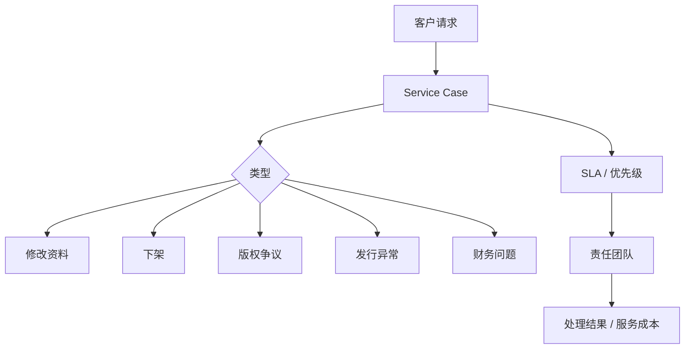

这一层是以后区分 Basic / Professional / Plus 服务价值的重要基础。

---

# 9. 当前系统与目标产品架构的关系

现有系统已经有较强的业务基础：

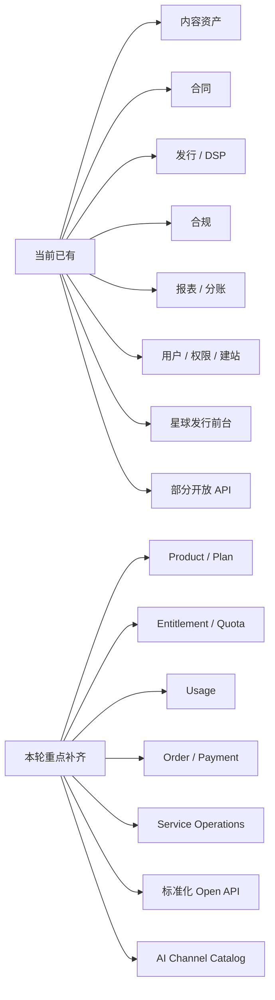

因此本轮不是“重做整个发行系统”，而是：

> **把已经存在的大量发行能力，重新组织成一套支持多产品、多商业模式和 AI 时代运营的产品平台。**

---

# 10. 三条产品的边界图

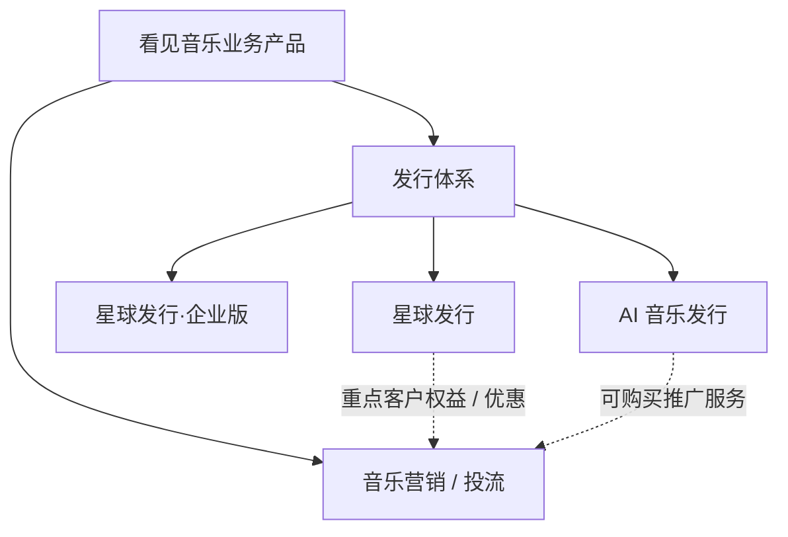

明确：

- 音乐营销 / 投流不是星球发行核心能力；
- Plus 可以获得跨产品战略权益；
- AI 音乐发行未来可以购买推广服务，但不把推广重新揉进发行产品；
- 企业版可以按模块扩展，但仍然保持产品边界清晰。

---

# 11. Phase 1 产品架构完成标准

以下问题已经明确：

- [x] 为什么拆成三条产品线；
- [x] 三条产品分别服务谁；
- [x] 三条产品的运营主体是谁；
- [x] 三条产品共用什么底层能力；
- [x] 哪些产品层必须独立；
- [x] 星球发行 Basic / Pro / Plus 的架构定位；
- [x] 企业版 White-label 与 API 的产品边界；
- [x] AI 音乐发行的产品边界与固定 AI DSP 原则；
- [x] Operator 模型；
- [x] 商业基础能力模型；
- [x] Service Operations 模型；
- [x] 宣发 / 投流边界；
- [x] 当前系统到目标架构的主要缺口。

因此：

> **产品架构 Phase 1 在 v1.0 层面收口。**

---

# 12. 后续推进顺序

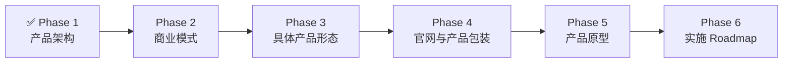

下一阶段按三条产品分别推进商业模式：

### 2A. 星球发行商业模式

- Basic / Professional / Plus；
- 准入；
- 分成；
- 艺人 / 曲库 / 发行额度；
- ISRC / UPC；
- 扩容；
- Add-on；
- SLA；
- 迁移规则。

### 2B. 企业版商业模式

- White-label；
- API；
- 接入 / 部署费；
- 模块费；
- 月费 / 年费；
- Usage；
- SLA。

### 2C. AI 音乐发行商业模式

- 按歌曲 / Release；
- 按渠道；
- 服务期限；
- 订阅；
- 发行额度；
- AI DSP 套餐；
- Add-on；
- 收益管理。

---

## 结论

整个产品体系最终应该被理解为：

```text
同一套发行基础设施
        ↓
不同 Operator
        ↓
不同 Product Policy
        ↓
不同商业关系
        ↓
形成三个独立产品
```

从此以后，不再以“做三个系统”的方式讨论拆分，而以：

> **统一能力平台如何支撑三个不同发行生意**

作为后续设计基线。
