# 三条产品线关键业务流与共享关系 v1.0

> 日期：2026-09-09  
> 状态：产品架构收口文档  
> 目的：用业务流而不是页面菜单说明三条产品线如何共享同一套发行能力，以及每条产品线在哪些环节形成自己的产品差异。

---

## 1. 一张图看懂整个发行产品体系

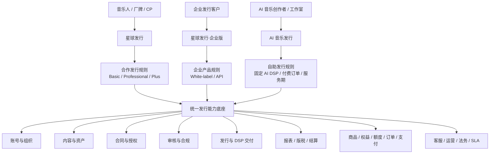

核心结论：

> **三个产品不是三条技术链路，而是三套产品规则驱动同一套发行能力。**

---

## 2. 三条产品线真正不同的地方

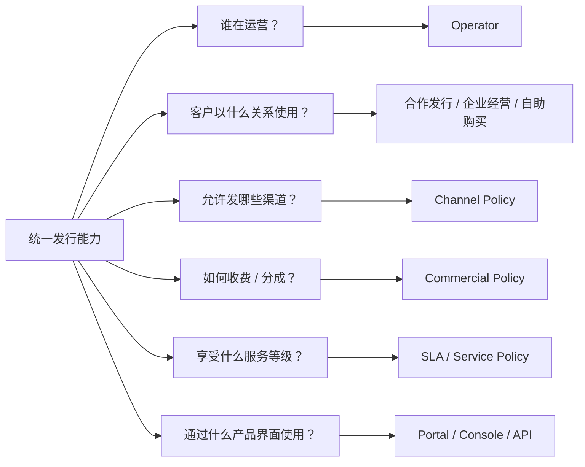

因此，产品差异主要放在：

- 产品与套餐；
- 权益与额度；
- 渠道策略；
- 合同策略；
- 审核策略；
- 服务等级；
- 收费与结算方式；
- 操作端与品牌体验。

而不应该通过复制 Catalog、Release、DSP、Report 等底层系统制造差异。

---

# 3. 星球发行：合作发行主流程

星球发行仍然是看见音乐自己运营的合作发行产品。

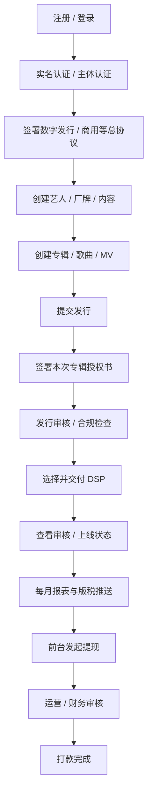

## 3.1 当前人工服务环节

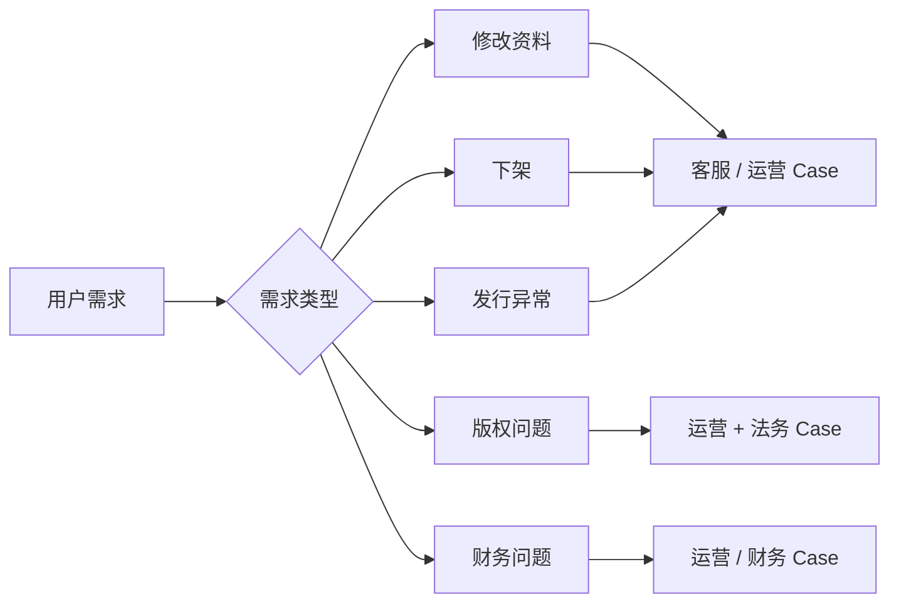

当前用户不能自行下架，改单、下架、版权争议等都存在明显人工成本。

因此 Basic / Professional / Plus 的重要差异不仅是系统额度，还包括：

- 人工处理权限；
- 响应时效；
- 优先级；
- 专属运营；
- 法务/版权协同；
- 特殊商务支持。

## 3.2 三档合作等级在流程中的作用位置

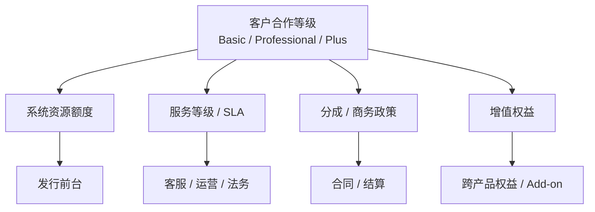

**合作等级不改变“能不能完成基础发行”，而决定使用边界、服务成本和合作深度。**

---

# 4. 星球发行·企业版：企业自己经营发行

企业版的核心不是“企业买一个后台”，而是：

> **企业客户获得一套可以自己开展发行业务的系统和能力。**

## 4.1 White-label SaaS 业务流

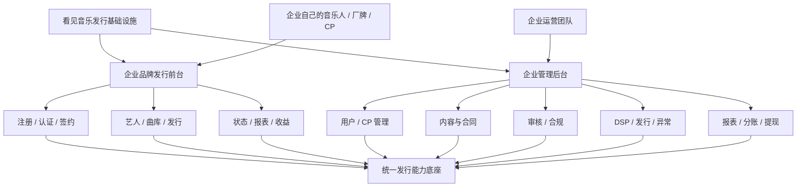

这里的 Operator 是企业客户。

企业可以拥有自己的：

- 品牌；
- 用户与 CP；
- 运营团队；
- 发行前台；
- 管理后台；
- 产品规则；
- 部分渠道及商务配置。

看见提供底层发行能力与基础设施。

## 4.2 API 业务流

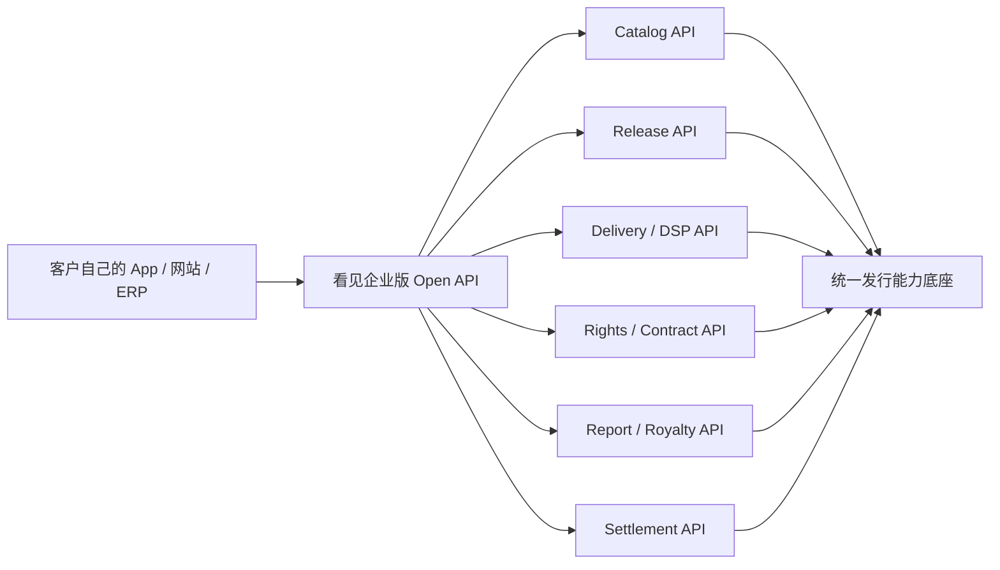

注意：

> **内部接口存在 ≠ 已经成为企业级开放 API 商品。**

API 产品化还需要：

- 稳定的外部模型；
- 鉴权；
- 租户隔离；
- 文档；
- 版本管理；
- 调用额度；
- Usage 计量；
- SLA；
- 错误码与事件通知；
- 商业开通与计费。

---

# 5. AI 音乐发行：付费自助发行主流程

AI 音乐发行是一条以 **AI 音乐流通** 为核心商品的新产品线。

它复用现有发行能力，但产品关系从“合作发行”变成“购买发行服务”。

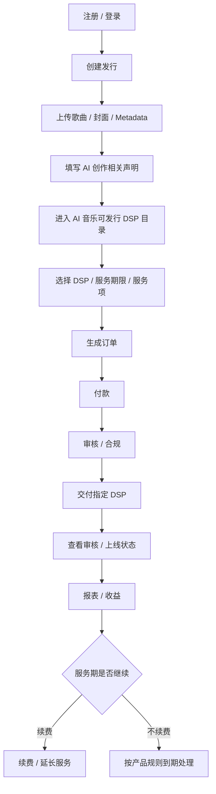

## 5.1 AI 音乐发行的渠道不是全部 DSP

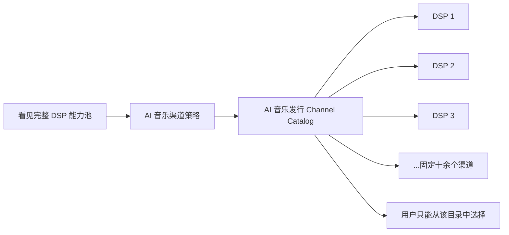

产品层负责维护：

- 哪些 DSP 对 AI 音乐开放；
- 哪些需要额外声明；
- 哪些渠道有特殊审核；
- 不同渠道价格是否不同；
- 不同服务期对应什么规则。

这套 Channel Catalog 是 AI 音乐发行的核心产品资产之一。

## 5.2 AI 音乐发行里的“商品”是什么

星球发行的核心关系是“合作 + 分成”；AI 音乐发行则是用户主动购买发行服务。

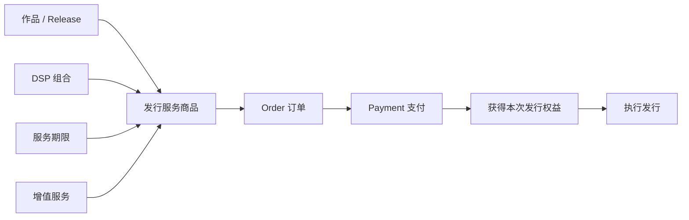

后续商业模式设计阶段再确定：

- 按歌曲；
- 按 Release；
- 按渠道；
- 按服务期；
- 订阅额度；
- Add-on；
- 混合收费。

产品架构阶段只冻结：**必须存在独立商品、订单、支付和服务期。**

---

# 6. 三条产品共享的主业务状态

从底层看，三条产品最终都围绕同一组核心对象运行。

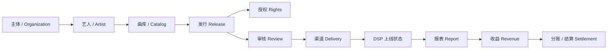

三条产品不能分别维护三套上述主数据。

它们应该通过以下上下文区分业务：

```text
产品 Product
+ 运营主体 Operator
+ 客户主体 Organization / CP
+ 套餐或合作等级 Plan / Tier
+ 渠道策略 Channel Policy
+ 商业规则 Commercial Policy
```

---

# 7. Product Policy 如何作用于共享能力

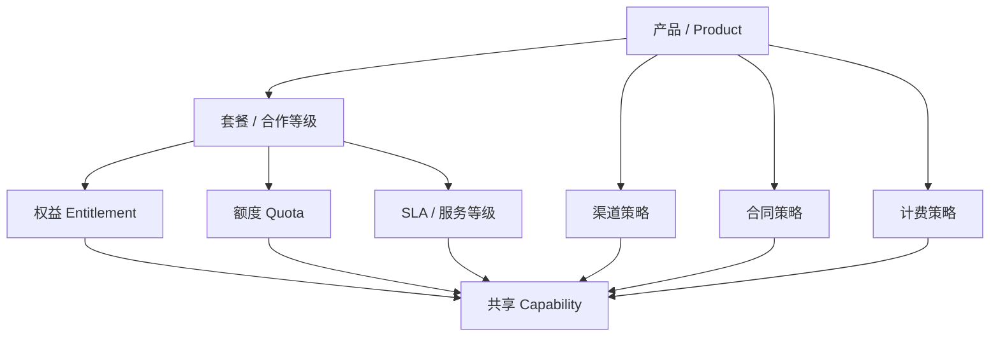

这样同一个发行能力可以表现成：

- 星球发行 Basic：标准额度 + 标准客服；
- 星球发行 Plus：高额度 + 专属运营 + 特殊商务；
- 企业版：按客户购买模块开放；
- AI 音乐发行：只有付款且符合 AI Channel Policy 才能执行。

---

# 8. 产品之间的边界关系

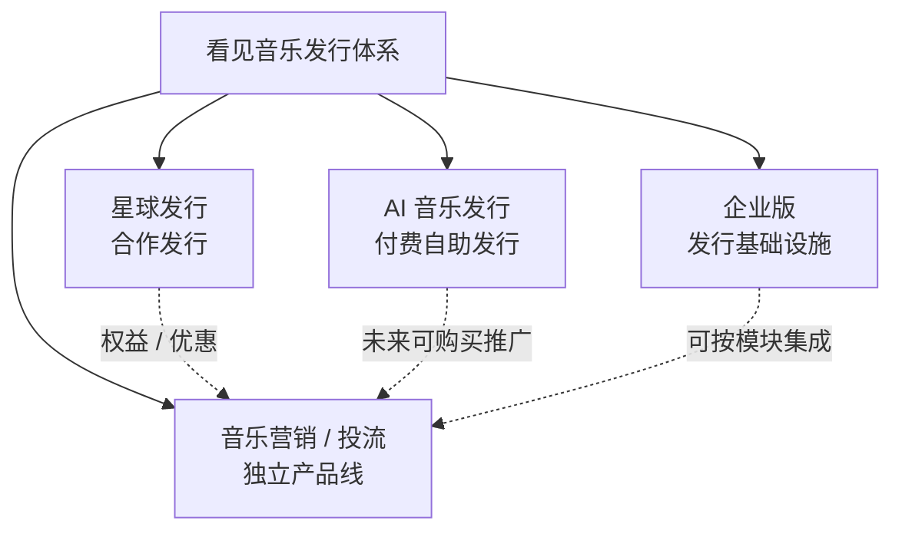

重要边界：

- 宣发推广不是星球发行核心发行权益；
- Plus 可以获得跨产品优惠或战略权益；
- AI 音乐发行以发行商品为核心，不把所有音乐服务都塞进一个产品；
- 企业版输出基础设施，不承担企业客户自己的运营定位。

---

# 9. 产品架构阶段已经冻结的业务流原则

1. 三条产品共用同一套 Catalog、Release、Delivery、Report 等核心 Domain。
2. 星球发行继续由看见运营，Basic / Professional / Plus 是合作等级与权益模型。
3. 企业版的 Operator 是企业客户，White-label 应同时包括管理后台和客户前台。
4. 企业版 API 必须作为正式 API Product 重新产品化，不能直接把内部接口当商品。
5. AI 音乐发行是独立付费自助产品，核心商品是 AI 音乐发行服务。
6. AI 音乐发行只开放独立维护的一组固定 AI DSP，不继承全部星发渠道。
7. AI 音乐与普通音乐共享底层内容与发行模型，但 AI 音乐发行的市场定位和产品策略围绕 AI 音乐流通设计。
8. 商品、订单、支付、权益、额度、Usage、服务期成为统一商业基础能力。
9. 人工客服、改单、下架、法务、版权争议等必须逐渐进入 Service Operations，而不能永远停留在微信群和人工记忆中。
10. 宣发/投流保持独立产品边界。

---

## 10. 下一阶段

本文件只描述业务流与产品架构关系，不确定具体：

- Basic / Professional / Plus 的数值与价格；
- 企业版各模块价格；
- AI 音乐发行具体单价与订阅档位；
- 具体官网信息架构；
- 具体页面和交互。

这些进入 **Phase 2：商业模式设计** 后分别确定。
