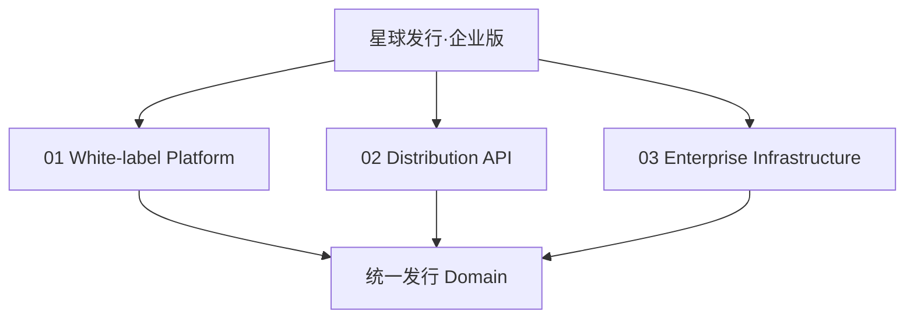
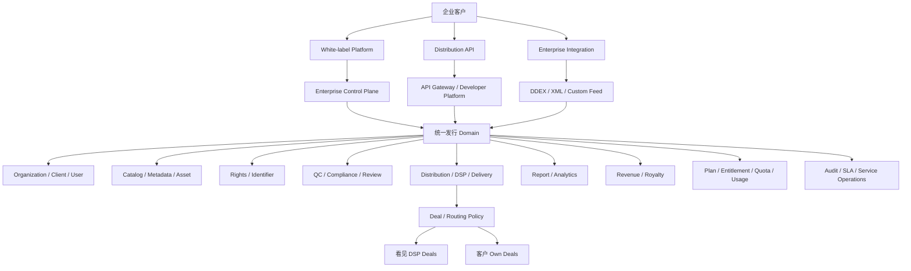
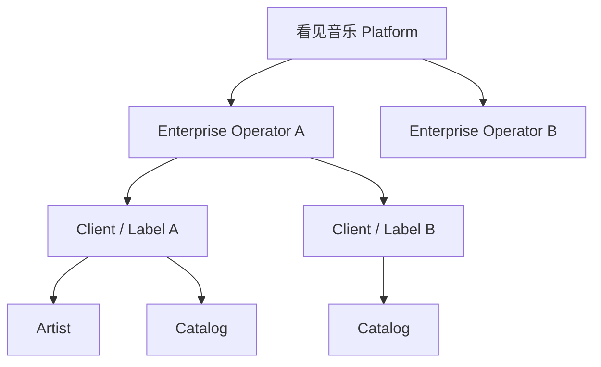
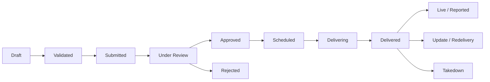
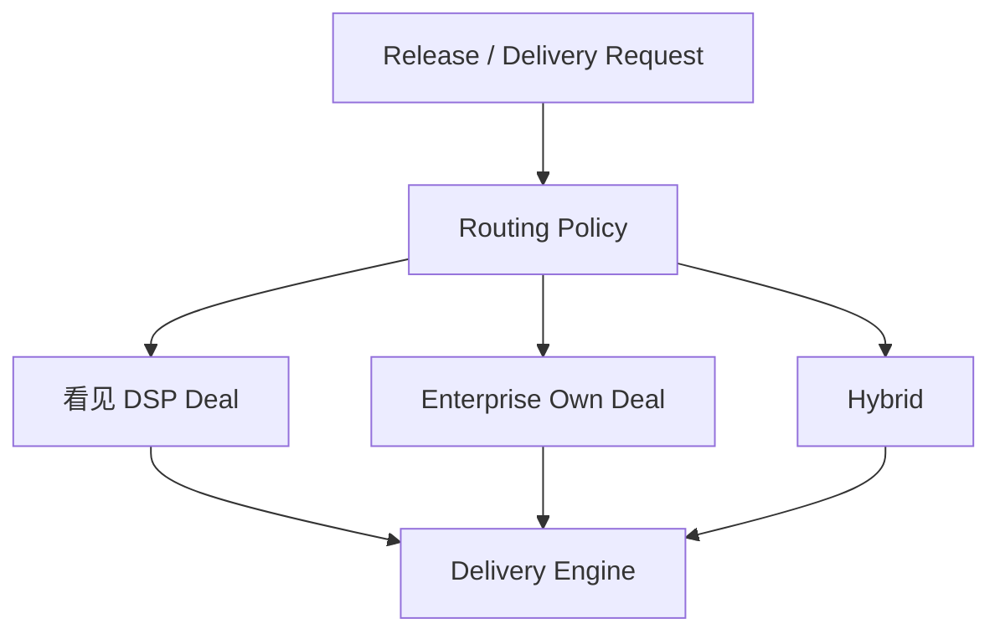
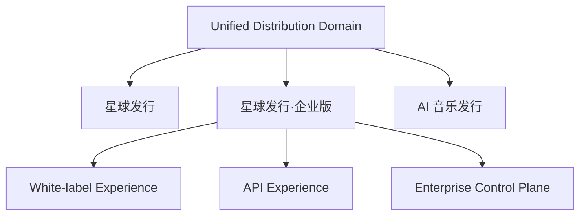
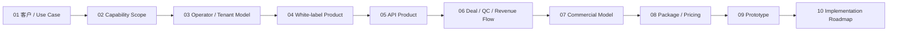

# 星球发行·企业版：产品定义与架构 v0.1

> 日期：2026-09-10  
> 状态：产品设计起点 / Working Baseline  
> 上游文档：`00-overview/product-architecture-summary-v1.0.md`  
> 行业研究：`06-research/enterprise-white-label-api-competitor-research-2026.md`

---

# 1. 本文要解决什么

当前「星球发行·企业版」已经在总产品架构中被定义为第三方企业使用的发行基础设施产品，但还缺少一份可继续往商业模式、产品原型和研发 Roadmap 推进的正式产品基线。

本轮结合：

- 已提供的企业版方向草稿；
- 当前看见音乐发行产品总架构；
- AudioSalad、FUGA、Revelator、SonoSuite、LabelGrid、EVEARA 等行业产品；
- 看见现有发行 Domain 与开放能力；

先建立 v0.1。

本文暂时不解决最终定价、首批客户报价、具体 UI 和研发排期，这些在后续阶段逐项收口。

---

# 2. 一句话产品定义

> **星球发行·企业版是看见音乐面向企业输出的音乐发行基础设施。企业可以通过 White-label 平台、API 或更深度的企业级接入，以自己的品牌、客户关系和商业模式开展音乐发行业务。**

更短的外部表达可以是：

> **让企业快速拥有自己的音乐发行平台与发行能力。**

---

# 3. 它不是什么

为了避免后续产品范围继续膨胀，先明确几个边界。

## 3.1 不是“星球发行最高档会员”

普通星球发行中：

```text
Operator = 看见音乐
看见直接经营音乐人 / 厂牌 / CP
```

企业版中：

```text
Operator = 企业客户
企业经营自己的下游客户
看见提供发行基础设施
```

两者商业关系完全不同。

## 3.2 不是单纯的大客户后台

即使一个客户 Catalog 很大，只要其仍然作为“看见音乐的 CP”被看见直接运营，它仍属于普通星球发行，而不是企业版。

进入企业版的关键不是规模，而是：

> **客户是否需要自己成为发行服务的 Operator。**

## 3.3 不是简单换 Logo 的 SaaS

Logo / Color / Domain 只是最低层的 Branding。

真正的 Enterprise White-label 必须允许企业管理：

- 自己的用户；
- 自己的厂牌和艺人；
- 自己的内容；
- 自己的审核关系；
- 自己的发行渠道策略；
- 自己的下游商业规则；
- 自己的数据和收益展示。

## 3.4 一期不是完整 Music Business OS

一期不以复制 Revelator 的：

```text
Contract
+ Publishing
+ Advanced Royalty Accounting
+ Global Payment
+ Marketplace
```

为目标。

第一阶段首先把 **Distribution Infrastructure** 做完整。

---

# 4. 为什么现在要有这条产品线

看见当前已经存在大量音乐发行基础能力：

- Catalog；
- Artist / Label / CP；
- Metadata；
- 文件；
- 权利 / 合同；
- 审核 / 合规；
- DSP；
- Delivery；
- 状态；
- 报表；
- 收益 / 结算；
- 用户 / 权限；
- 部分开放 API。

如果这些能力只能服务“看见自己经营的星球发行”，其商业价值被限制在单一发行商模式中。

企业版的本质是把同一套底层能力进一步产品化：

```text
Internal Distribution Capability
                ↓
Standardized Distribution Infrastructure
                ↓
White-label / API / Enterprise Integration
                ↓
External Enterprise Revenue
```

因此企业版不是重新做一套发行系统，而是：

> **把现有发行能力变成可以标准交付给第三方企业的产品。**

---

# 5. 目标客户

v0.1 先定义五类潜在客户，后续根据真实客户和销售线索继续收窄。

## A. 独立发行商

已经在经营发行客户，但技术系统较弱，希望直接采购完整基础设施。

典型需求：

- White-label；
- 多 Label / Client；
- QC；
- 全球 DSP；
- Report / Royalty；
- Own Deal。

## B. 厂牌集团 / 版权公司

拥有较多下属厂牌、音乐人或合作 CP，希望用自己的业务系统统一管理并发行。

典型需求：

- 多组织；
- Catalog；
- 审核；
- Batch；
- API；
- Report。

## C. 音乐工具 / SaaS / 创作平台

已经拥有音乐创作者用户，希望增加“发行”作为产品能力。

典型需求：

- API；
- 自有 UI；
- 用户与发行绑定；
- Webhook；
- 自动化；
- Usage Billing。

## D. 内容平台 / 社区 / 流媒体产品

希望把平台中的内容进一步发行到外部 DSP，或增加创作者变现链路。

典型需求：

- API；
- Bulk；
- Rights / Compliance；
- Delivery；
- Status；
- Reporting。

## E. AI 音乐企业 / AI 创作平台

自身拥有大量 AI 音乐生成用户，希望为创作者提供合规发行能力。

典型需求：

- API；
- AI 内容声明；
- AI DSP Channel Policy；
- 高频上传控制；
- 风险审核；
- Usage / Quota。

这一类客户与独立的「AI 音乐发行」零售产品不同：

> AI 音乐发行是看见直接面对创作者；企业版是把能力输出给 AI 企业，由企业自己面对创作者。

---

# 6. 产品的三个接入层级

建议正式把企业版设计成三个层级，而不是只有“白标 / API”两个按钮。



---

## 6.1 White-label Platform

### 定义

> 看见提供完整 Hosted SaaS，企业不需要开发发行系统即可用自己的品牌运营。

### 企业看到的产品

```text
Enterprise Console
+ Client / Label Portal
+ Branded Distribution Frontend
```

### 基础能力

- 自定义品牌；
- 自定义域名；
- Login / Signup；
- Enterprise Admin；
- Client / Label / Artist；
- Release Creation；
- QC / Review；
- DSP Distribution；
- Report / Revenue；
- 企业客服入口；
- 企业规则配置。

### 适合客户

- 没有研发能力；
- 希望快速上线；
- 中小发行商；
- 厂牌集团；
- 艺人服务公司。

---

## 6.2 Distribution API

### 定义

> 客户保留自己的产品与 UI，通过标准 Open API 使用看见音乐发行基础能力。

### 核心能力

```text
Auth
Organization / Client
Artist / Label
Catalog
Metadata
Asset
Release
Validation
Submit
Review Status
DSP Selection
Delivery
Delivery Status
Update
Takedown
Report
Revenue
Webhook
```

### Developer Experience

API 产品不只是 Endpoint，还必须包含：

- Developer Center；
- API Credential；
- Sandbox；
- API Docs；
- Webhook；
- Event Log；
- Delivery Log；
- Error Code；
- Rate / Quota；
- Usage Dashboard。

### 适合客户

- SaaS；
- 创作工具；
- AI 音乐平台；
- 已有内部系统的大型版权公司；
- 希望自建用户体验的平台型客户。

---

## 6.3 Enterprise Infrastructure

### 定义

> 面向成熟发行商和大型平台的深度供应链接入形态。

它不是第三套系统，而是 White-label / API 下面同一个 Domain 的更高级能力包。

可能包含：

- DDEX；
- XML / Bulk Feed；
- Own DSP Deals；
- Hybrid Deal；
- Custom Delivery Routing；
- Custom QC Workflow；
- Advanced Webhook；
- Data Feed；
- Dedicated Environment / Network Policy；
- Custom SLA；
- Migration / Catalog Import；
- Enterprise Support。

### 适合客户

- 已有 DSP 直签关系的发行商；
- 大型 Catalog；
- 海量自动化交付；
- 大型版权集团；
- 国际化平台。

---

# 7. 总体产品架构



---

# 8. Enterprise Control Plane

这是企业版相较普通发行后台最重要的新产品层。

每个企业 Operator 应拥有自己的 Control Plane。

```text
Enterprise Operator
│
├── Identity & Branding
├── Organization
├── Clients / Labels / Artists
├── Users / Roles
├── Feature Entitlement
├── DSP & Deal Policy
├── QC Policy
├── Pricing / Commercial Policy
├── Quota / Usage
├── API Credentials
├── Webhooks
├── Reports
└── Support / SLA
```

它回答的是：

> **“这家企业如何经营自己的发行平台？”**

而不是：

> “它今天上传了多少首歌？”

---

# 9. 组织与租户模型

企业版必须把多租户与下游客户层级作为一等 Domain，而不是后期用权限补丁实现。

建议概念模型：



基础对象建议：

```text
Platform
Operator
Organization
Client
User
Role
Label
Artist
```

其中：

### Operator

代表经营发行服务的企业主体。

关联：

- Brand；
- Contract；
- Plan；
- Entitlement；
- DSP Policy；
- Deal Policy；
- QC Policy；
- Commercial Policy；
- SLA。

### Client

企业 Operator 的下游客户。

一期可把 Label / CP 作为主要 Client 类型，不急于建立无限组织层级。

---

# 10. White-label 的正确产品边界

White-label 分成四层。

## L1 Brand

```text
Name
Logo
Favicon
Primary Color
Custom Domain
Email Sender
Login / Signup
Terms / Privacy
Support Contact
```

## L2 Customer Experience

```text
Client Signup
Client Login
Catalog
Release Wizard
Status
Reports
Balance / Revenue
Support
```

## L3 Business Configuration

```text
Enabled Features
Enabled DSPs
Client Pricing
Quota
Revenue Share
Support Level
```

## L4 Operating Control

```text
Review
Approve / Reject
Exception
Delivery Control
Client Management
Audit
SLA
```

因此产品验收不能以“可以换 Logo”为 White-label 完成标准。

---

# 11. Distribution API 的正确产品边界

API 应围绕业务生命周期，而不是把现有后台 Controller 原样暴露出去。

建议资源结构：

```text
/operators
/clients
/users
/labels
/artists
/releases
/tracks
/assets
/rights
/validations
/distribution-orders
/deliveries
/stores
/reports
/revenues
/webhooks
```

核心生命周期：



API v1 必须保证：

- 客户能知道状态；
- 客户能知道失败原因；
- 客户能通过 Webhook 接收异步结果；
- 重复请求不会制造重复发行；
- Update / Takedown 有明确对象和状态；
- API 和 White-label 不产生两套状态机。

---

# 12. Distribution Deal 与 Delivery Engine

这是 v0.1 最重要的架构原则之一。

不要把：

> “交付到 Spotify”

直接等同于：

> “使用看见和 Spotify 的发行合同”。

未来正确模型应该是：



可能的策略维度：

- Operator；
- DSP；
- Territory；
- Content Type；
- Release；
- Contract；
- Risk Policy。

### 一期建议

一期可以只允许：

```text
Kanjian Deal
```

但 Domain Model 和 Delivery Engine 不要把这个选择写死。

---

# 13. QC / Review 模型

企业版必须明确“谁在审核”。

未来建议支持三种模式：

```text
Mode A
Enterprise Submit → Kanjian QC → DSP

Mode B
Client Submit → Enterprise Review → Kanjian QC → DSP

Mode C
Client Submit → Enterprise Review → Direct Delivery
（只对特定 Own Deal / Enterprise 客户开放）
```

v1 默认建议：

> **Client → Enterprise Operator Review → Kanjian Final QC → DSP。**

这样既让企业保持 Operator 控制权，也保护看见 DSP Deal 的合规质量。

---

# 14. 收益与结算边界

这里是后续必须重点收口的产品范围。

行业存在三种深度：

## Level 1：Report to Enterprise

```text
DSP Revenue
→ Kanjian
→ Enterprise
```

企业自己负责向下游客户计算和支付。

## Level 2：Royalty Accounting to Client

```text
DSP Revenue
→ Kanjian
→ Enterprise Rule
→ Client / Artist Split
→ Statement
```

系统帮助企业算到其下游客户。

## Level 3：Payout Infrastructure

```text
Statement
→ Balance
→ Payout Request
→ KYC / Tax / Payment Rail
→ Payment
```

### v0.1 建议

第一阶段至少做到 Level 1；

如果看见现有版税能力复用成本较低，可以逐步支持 Level 2；

Level 3 不应作为首发阻塞项。

理由：

- Payment 是独立复杂基础设施；
- 各企业合同、税务、主体差异很大；
- ampsuite / SonoSuite 等行业产品也存在“系统处理应付与请求，但实际付款在平台外完成”的过渡模式。

---

# 15. 企业自己的商业规则

White-label 真正成立以后，必须区分两层商业关系。

```text
A. 看见 → Enterprise
B. Enterprise → End Client
```

## A. 看见对 Enterprise 收费

可能包括：

- Setup Fee；
- Base Subscription；
- Module Fee；
- Catalog Capacity；
- Track / Release / Delivery Usage；
- Royalty Processed；
- Storage；
- API / DDEX；
- SLA；
- Distribution Revenue Share。

## B. Enterprise 对 End Client 收费

企业应逐步能够自行配置：

- 是否收费；
- Subscription / Pay per Release；
- Revenue Share；
- UPC / ISRC；
- Delivery；
- QC；
- Takedown / Update；
- Quota。

这一层不能和看见自己的收费模型写成同一套价格表。

---

# 16. 建议的能力分层

## Core Distribution Infrastructure

首要建设：

```text
Tenant / Operator
Client / User / Role
Catalog / Metadata / Asset
Rights / Identifier
QC / Validation / Review
DSP / Channel
Delivery
Status
Update / Redelivery
Takedown
Reporting
API / Webhook
Audit
Quota / Usage
```

## Business Operations

第二阶段：

```text
Client Pricing
Revenue Share
Royalty Statement
Balance
Invoice / Order
Advanced SLA
```

## Enterprise Supply Chain

第三阶段或大客户驱动：

```text
Own DSP Deal
DDEX
Bulk Feed
Custom Routing
Advanced Workflow
Data Feed
Migration
Dedicated Support
```

## Extended Music Business OS

需求验证后再做：

```text
Advanced Contract
Publishing
Recoupment
Global Payout
Tax
Marketplace
Marketing Tools
```

---

# 17. 一期建议产品范围

当前阶段不直接进入研发排期，但为了限制方案发散，先定义一个建议的 MVP 完整闭环。

## P0：企业版最小可售闭环

### Enterprise Foundation

- Enterprise Operator；
- 企业管理员；
- Client / Label；
- User / Role；
- Entitlement / Quota。

### White-label

- Brand；
- Domain；
- Login；
- 企业发行 Portal；
- 基础企业 Console。

### Catalog & Distribution

- Artist / Label；
- Release / Track；
- Audio / Artwork；
- Metadata Validation；
- ISRC / UPC；
- DSP Selection；
- Submit；
- Review；
- Kanjian QC；
- Delivery；
- Delivery Status；
- Update；
- Takedown。

### Report

- 基础 Streaming / Revenue Report；
- Enterprise 可查看自己 Catalog 数据。

### API

第一批 API 至少覆盖与 White-label 首发链路相同的核心业务生命周期。

### Operations

- Audit Log；
- Usage；
- Support / SLA 基础能力。

---

# 18. 建议暂不放入首发阻塞项

除非首批付费客户明确需要，否则以下不应拖慢 P0：

- 完整 DDEX 客户接入；
- 企业 Own DSP Deal；
- 多层无限 Sub-distributor；
- 完整 Royalty Contract Engine；
- Recoupment；
- Global Payout；
- Publishing；
- Marketing Marketplace；
- 原生 App；
- 高度自由 Workflow Builder。

这些能力都应在 Domain 层留接口，但不要求 P0 全部做完。

---

# 19. 与统一发行底座的关系

总仓库已经明确原则：

> **一套发行 Domain，多种商业产品。**

企业版继续遵循这一原则。



必须共享：

- Artist；
- Label；
- Release；
- Track；
- Asset；
- Rights；
- DSP；
- Delivery；
- Report；
- Revenue 基础对象。

企业版独有或重点强化：

- Operator；
- Client Hierarchy；
- Branding；
- Enterprise Policy；
- API Credential；
- Webhook；
- Own Deal；
- Enterprise Pricing；
- Usage / SLA。

---

# 20. 五条架构原则

后续所有方案建议都用这五条做校验。

## Principle 1

> **White-label 与 API 是同一产品底座的两种 Experience，不是两套发行系统。**

## Principle 2

> **Enterprise Customer 是 Operator，不是普通 CP。**

## Principle 3

> **Distribution Deal 与 Delivery Technology 解耦。**

## Principle 4

> **White-label 的核心是 Operating Control，不是 Branding。**

## Principle 5

> **先做 Distribution Infrastructure，再决定是否继续扩成 Music Business OS。**

---

# 21. 商业模式初步方向

本轮还不定最终价格，只确定计费结构方向。

行业更合理的公式是：

```text
Enterprise Fee
=
Base Platform Fee
+ Capacity / Usage
+ Optional Modules
+ SLA / Service
+ Distribution Economics
```

## 推荐优先研究的计费锚点

### Capacity

- Active Tracks；
- Catalog Assets；
- Labels / Clients；
- End Users；
- Admin Seats。

### Usage

- New Releases；
- Tracks Delivered；
- DSP Deliveries；
- Storage；
- Data Processing。

### Business Scale

- Monthly Royalties Processed；
- Revenue Band。

### Premium Capability

- API；
- DDEX；
- Own Deal；
- Advanced Report；
- Royalty Accounting；
- Dedicated SLA。

暂不建议把“API Request 次数”作为主要定价锚点。

---

# 22. 当前仍然未知、后续必须补的信息

后续方案设计优先向真实业务获取以下信息：

## 客户

- 历史上是否已经有类似企业版客户；
- 当前有哪些明确销售线索；
- 客户规模；
- 客户 Catalog；
- 客户用户数量；
- 客户发行量；
- 客户是否已有 DSP Deal。

## 现有能力

- 当前开放 API 到什么程度；
- 是否已经有标准 Release API；
- 是否有 Webhook；
- 是否有 Tenant 隔离；
- 是否已有 White-label / 建站能力；
- 报表是否支持 Operator 隔离；
- 版税是否支持多层计算；
- DSP Delivery 是否支持路由不同合同。

## 商业

- 历史 Enterprise 项目报价；
- 实际交付成本；
- DSP 分成 / 发行成本；
- 人工 QC 成本；
- 客户支持成本；
- 存储 / Delivery 成本；
- 是否需要 Setup / Implementation Fee。

## 合规

- 企业版下游客户合同由谁签；
- DSP 责任由谁承担；
- Enterprise 是否可自己 QC；
- 违规内容的责任链；
- KYC / Copyright / AI Disclosure 如何传递。

---

# 23. 后续产品设计顺序

建议从本文继续按以下顺序推进，而不是直接画页面：



下一步最优先回答：

> **“第一批企业客户到底是谁，他们实际希望用星球发行企业版完成什么业务？”**

因为这个答案会决定 White-label、API、Royalty、Own Deal、DDEX 各自在第一阶段的优先级。

---

# 24. v0.1 当前结论

当前先收口以下结论：

- [x] 星球发行企业版属于独立企业产品线；
- [x] 企业客户成为 Operator；
- [x] 产品本质是 Music Distribution Infrastructure；
- [x] White-label 与 API 共用统一发行 Domain；
- [x] White-label 不等于简单 Branding；
- [x] API 必须覆盖发行生命周期并支持异步状态；
- [x] Enterprise Control Plane 是核心产品层；
- [x] Distribution Deal 与 Delivery Engine 应解耦；
- [x] 长期需要支持 Own Deal / DDEX，但不要求 P0 全量完成；
- [x] P0 优先完成 Distribution Infrastructure；
- [x] Royalty / Payment 分阶段建设；
- [x] 企业商业关系与看见对企业的收费关系必须分层。

这份 v0.1 作为后续星球发行企业版方案设计的起点，后续每一轮新增信息都应继续更新本目录下的产品定义、商业模式与 Roadmap，而不是重新回到零散讨论。