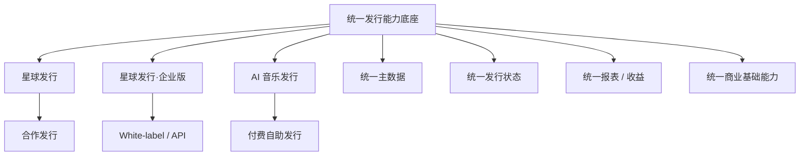
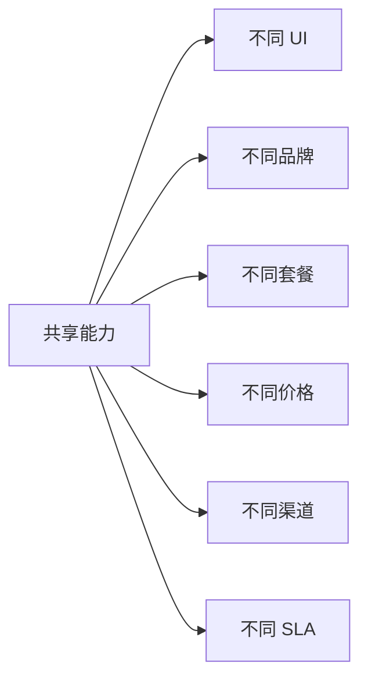
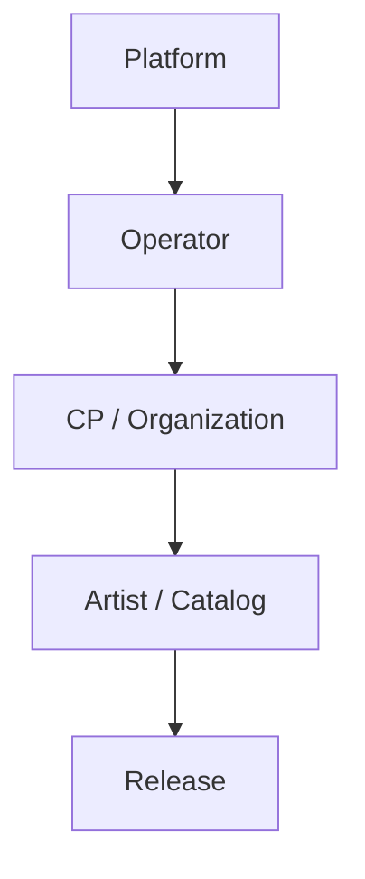
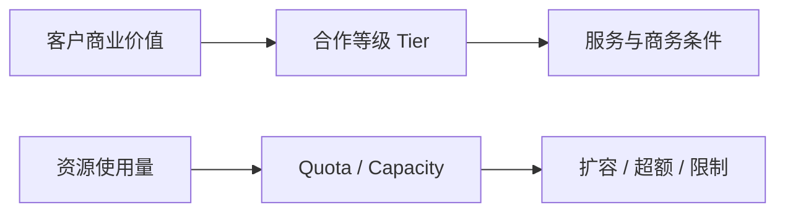
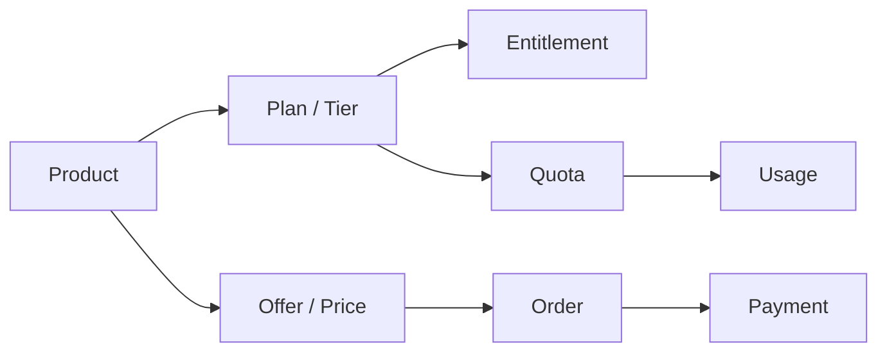
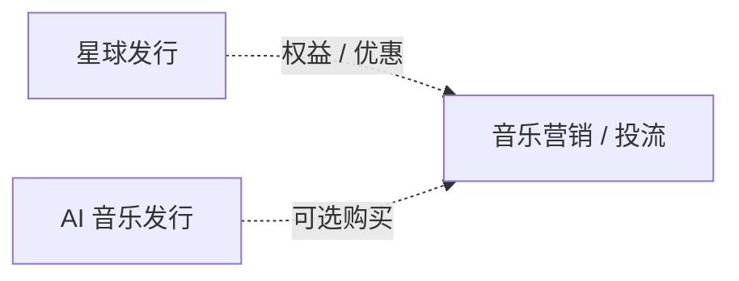

# 产品架构决策清单 v1.0

> 日期：2026-09-09  
> 状态：Phase 1 产品架构决策基线  
> 用途：记录已经确认的产品架构原则，避免后续商业模式、产品设计、官网和原型阶段重复争论已经确定的问题。

---

## 决策总览



---

## ADR-001：采用“一套发行底座 + 三条产品线”

**状态：已接受**

### 决策

不为星球发行、企业版、AI 音乐发行分别建设三套独立发行系统。

统一复用：

- 用户与组织；
- Catalog；
- 资产与文件；
- 合同与授权；
- 发行与审核；
- DSP / Delivery；
- 报表与收益；
- 结算；
- 商业基础能力。

### 原因

三条产品的本质差异是客户关系、运营主体、商业模式、渠道策略和产品体验，而不是底层发行对象不同。

### 禁止的方向

```text
星球发行歌曲表
企业版歌曲表
AI 发行歌曲表
```

或三套独立 Release / Report / Revenue 主数据。

---

## ADR-002：产品线不等于系统边界

**状态：已接受**

### 决策

商业产品可以独立，底层能力必须尽量共享。



### 影响

后续研发拆仓库、拆服务、拆前端时，应按照技术和部署边界决定，而不是因为存在三个产品就机械拆成三套系统。

---

## ADR-003：引入 Operator 作为产品架构核心概念

**状态：已接受**

### 决策

明确“谁在经营这次发行关系”。



| 产品 | Operator |
|---|---|
| 星球发行 | 看见音乐 |
| 企业版 White-label | 企业客户 |
| 企业版 API | 企业客户 |
| AI 音乐发行 | 看见音乐 / 自助系统 |

### Operator 关联

- 品牌；
- 客户归属；
- 合同主体；
- 产品与套餐；
- 可用渠道；
- 审核策略；
- 服务策略；
- 报表与结算关系。

---

## ADR-004：星球发行 Basic / Professional / Plus 是合作等级，不是三套前台

**状态：已接受**

### 决策

三档都建立在同一套星球发行前台上。

差异由以下维度表达：

```text
合作准入
+ Entitlement 权益
+ Quota 额度
+ SLA 服务等级
+ 商务 / 分成政策
+ Add-on / 跨产品权益
```

### 原则

基础版不能通过大面积删除正常发行能力来制造差异。

核心发行流程应保持成立，分层重点解决：

- 资源成本；
- 存储成本；
- 人工服务成本；
- 客户价值差异；
- 头部客户战略服务。

---

## ADR-005：资源消耗与客户价值分开建模

**状态：已接受**

### 决策

“内容多”不等于“客户价值高”。

客户合作等级与资源容量必须分开：



### 影响

一个收入低但拥有大量曲库的 CP，不应自动升级为 Professional / Plus；可以仍是 Basic，但承担更高资源使用成本。

---

## ADR-006：企业版 White-label 是“管理后台 + 发行前台”完整产品

**状态：已接受**

### 决策

企业版 White-label 不等于给客户一个管理后台换 Logo。

完整形态包括：

```text
企业品牌
├── Management Console
└── CP / Creator Portal
```

企业自己的音乐人、厂牌、CP 在前台完成发行；企业运营团队在后台完成管理、审核、发行、报表、分账等工作。

---

## ADR-007：企业版 API 必须独立产品化

**状态：已接受**

### 决策

内部接口、权限 API 与正式对外 Open API 不是同一个概念。

正式 API Product 至少应具备：

- 对外稳定数据模型；
- API Key / OAuth 等鉴权；
- 租户隔离；
- 版本管理；
- 文档；
- 错误码；
- Webhook / Event；
- Usage 计量；
- 调用额度；
- SLA；
- 商业开通和计费。

### 影响

后续企业版“可卖 API 能力”必须单独盘点，不直接依据内部权限树对外承诺。

---

## ADR-008：AI 音乐发行是一条独立的付费自助产品线

**状态：已接受**

### 决策

AI 音乐发行专门围绕 AI 音乐流通场景设计，其主要商品是 AI 音乐发行服务。

与星球发行的核心区别：

| 星球发行 | AI 音乐发行 |
|---|---|
| 合作发行关系 | 购买发行服务 |
| 版税分成为主 | 服务收费为主 |
| 人工合作属性较强 | 自助、标准化、规模化 |
| 使用星发渠道策略 | 独立 AI DSP Channel Catalog |

---

## ADR-009：AI 音乐发行只开放独立维护的一组 AI DSP

**状态：已接受**

### 决策

AI 音乐发行不直接继承星球发行全部 DSP。


### 影响

AI 音乐发行的渠道目录本身属于产品能力，应支持：

- 渠道上下架；
- 特殊审核规则；
- AI 声明要求；
- 渠道价格；
- 服务期限策略。

---

## ADR-010：AI 音乐与普通音乐不建立两套底层 Catalog / Release 模型

**状态：已接受**

### 决策

AI 音乐、AI 辅助创作、普通音乐共用内容与发行 Domain。

AI 特征作为属性和合规信息存在，例如：

- AI 生成声明；
- AI 辅助声明；
- 模型 / 来源信息；
- DSP 合规要求。

### 原因

产品定位可以围绕 AI 音乐，但底层内容对象没有必要分叉。

---

## ADR-011：商业基础能力统一建设

**状态：已接受**

### 决策

三个产品后续都应复用统一商业基础能力：



### 用途

- 星球发行：版本权益、额度、扩容、Add-on；
- 企业版：模块开通、月费、Usage、API 调用；
- AI 音乐发行：按次商品、订阅、渠道、服务期限。

---

## ADR-012：人工服务必须成为正式产品能力

**状态：已接受**

### 决策

将目前散落在线下沟通中的人工服务逐渐纳入 Service Operations。

```text
Service Case
├── 修改资料
├── 下架
├── 版权争议
├── 发行异常
├── 财务问题
└── 其他客服事项
```

并关联：

- 客户；
- Release；
- 责任团队；
- SLA；
- 优先级；
- 处理时长；
- 服务成本。

### 原因

Basic / Professional / Plus 的重要价值差异来自人工服务，如果系统无法表达，就无法真正进行服务分层和成本管理。

---

## ADR-013：宣发 / 投流保持独立产品边界

**状态：已接受**

### 决策

音乐推广不是星球发行的核心发行功能。



重点客户可以获得免费资源、优惠或战略支持，但应被定义为跨产品权益，而不是重新混入发行核心产品。

---

## ADR-014：现有 SaaS 是企业版的重要基础，不等于未来企业版产品本身

**状态：已接受**

### 决策

现有 SaaS 已具备较完整的：

- 内容；
- 合同；
- 发行；
- DSP；
- 合规；
- 报表；
- 分账；
- 用户；
- 角色；
- 建站等能力。

但未来企业版还需要重新完成：

- 能力包装；
- 模块边界；
- API 产品化；
- 白标标准；
- 商业开通；
- 套餐与计费；
- SLA。

---

## ADR-015：产品架构先于商业模式，商业模式先于产品形态

**状态：已接受**

### 决策

本项目固定推进顺序：


### 原因

避免先做页面、套餐或报价，再反过来拼产品结构。

---

# 尚未冻结、进入后续阶段决定的问题

以下不属于产品架构未完成，而属于后续阶段需要确定的商业参数：

- Basic / Professional / Plus 具体准入标准；
- 各档艺人、歌曲、发行、ISRC / UPC 等额度；
- 具体分成比例；
- 扩容包与 Add-on 价格；
- 企业版 SaaS / API 报价；
- AI 音乐发行按次、订阅或混合收费结构；
- AI DSP 的实际渠道清单与具体价格；
- 官网信息架构和文案；
- 具体页面、流程优化和原型。

这些进入 Phase 2 之后分别设计。
