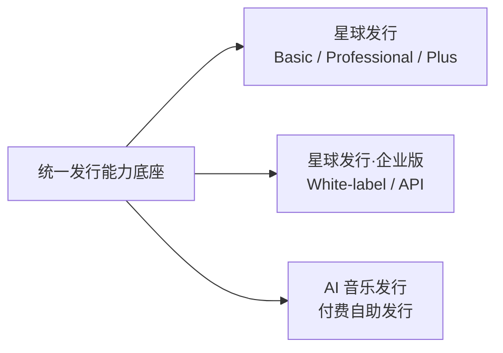

# 看见音乐发行产品体系

本仓库用于沉淀看见音乐发行产品体系的：

- 产品架构；
- 商业模式；
- 产品包装；
- 官网方案；
- 产品原型；
- Roadmap 与关键决策。

当前产品体系包含三条产品线：



## 当前阶段

**Phase 1：产品架构已收口。Phase 2：商业模式设计进行中；星球发行商业模式已完成 v1.1，星球发行·企业版已完成产品定义 / 行业基线并进入官网原型迭代。**


## 核心文档

### 项目与架构

- `00-overview/project-context.md`：项目背景与现状基线
- `00-overview/product-architecture-v0.1.md`：产品架构初版
- `00-overview/product-architecture-summary-v1.0.md`：**Phase 1 产品架构收口版**

### 共享能力与业务流

- `01-shared-foundation/product-capability-map-v0.1.md`：产品能力地图
- `01-shared-foundation/current-to-target-gap-map-v0.1.md`：当前能力到目标架构 Gap
- `01-shared-foundation/three-product-business-flow-v1.0.md`：**三产品关键业务流与共享关系**

### 产品线

- `02-star-release/commercial-model-v1.1.md`：**星球发行商业模式正式基线**
- `02-star-release/commercial-model-v1.0.md`：上一轮商业模式设计稿，保留用于版本追溯
- `03-enterprise/product-definition-and-architecture-v0.1.md`：**星球发行·企业版产品定义与架构起点**
- `03-enterprise/prototype-v1/`：**星球发行·企业版官网原型 v1（Vercel `/enterprise`）**
- `04-self-service-distribution/`：AI 音乐发行 / 付费自助发行

### 商业与研究

- `05-commercial/`：统一商业能力与定价框架
- `06-research/global-distribution-business-models-2026.md`：海外零售发行商业模式研究
- `06-research/enterprise-white-label-api-competitor-research-2026.md`：**企业音乐发行基础设施 White-label / API 竞品研究**
- `07-decisions/product-architecture-decisions-v1.0.md`：产品架构决策清单
- `07-decisions/star-release-revenue-share-policy-v1.0.md`：星球发行分成政策决策

## 架构原则

> **一套发行 Domain，多种商业产品。共享能力，不复制三套发行系统。**

三个产品的差异主要由以下部分表达：

```text
Operator
+ Product / Tier / Plan
+ Entitlement / Quota / Usage
+ Channel Policy
+ Contract / Approval Policy
+ Pricing / Order / Payment
+ Service / SLA
+ 独立产品体验与品牌
```
