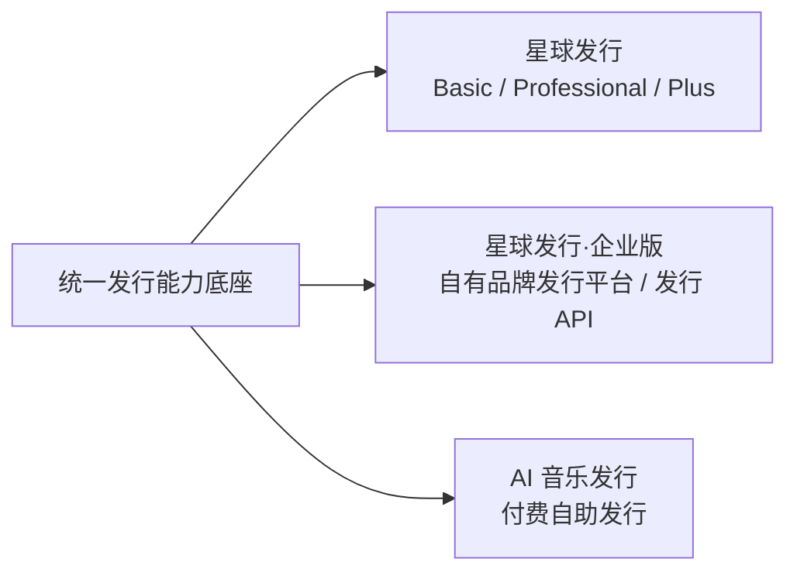

# 看见音乐发行产品体系

本仓库用于沉淀看见音乐发行产品体系的产品架构、商业模式、产品包装、官网方案、产品原型、Roadmap 与关键决策。

当前产品体系包含三条产品线：



## 当前阶段

- 产品总架构已收口；
- 星球发行商业模型已进入正式版本；
- 星球发行·企业版已完成产品范围、正式价格、官网信息架构与对外 Demo，进入真实商业闭环与系统化交付阶段；
- AI 音乐发行持续推进商业模型、渠道策略与自助发行体验。

## 核心文档

### 项目与架构

- `00-overview/project-context.md`：项目背景与现状基线
- `00-overview/product-architecture-summary-v1.0.md`：产品架构收口版

### 共享能力与业务流

- `01-shared-foundation/product-capability-map-v0.1.md`：产品能力地图
- `01-shared-foundation/current-to-target-gap-map-v0.1.md`：当前能力到目标架构 Gap
- `01-shared-foundation/three-product-business-flow-v1.0.md`：三产品关键业务流与共享关系

### 产品线

- `02-star-release/commercial-model-v1.1.md`：星球发行商业模式正式基线
- `03-enterprise/README.md`：**星球发行·企业版唯一权威基线**
- `03-enterprise/prototype-v4/`：企业版当前正式官网 / 产品 Demo 实现
- `04-self-service-distribution/`：AI 音乐发行 / 付费自助发行

### 研究与决策

- `06-research/global-distribution-business-models-2026.md`：全球发行商业模式研究
- `07-decisions/product-architecture-decisions-v1.0.md`：产品架构决策清单
- `07-decisions/star-release-revenue-share-policy-v1.0.md`：星球发行分成政策决策

## 架构原则

> **一套发行 Domain，多种商业产品。共享能力，不复制三套发行系统。**

不同产品主要通过以下层次形成差异：

```text
Operator
+ Product / Tier / Plan
+ Entitlement / Quota / Usage
+ Channel Policy
+ Contract / Approval Policy
+ Pricing / Order / Payment
+ Service / SLA
+ 独立产品体验与品牌
```

## 文档维护原则

各产品线仅保留当前有效的权威基线。被后续决策推翻的历史版本不继续保留为工作文档；需要追溯时使用 Git 历史。
